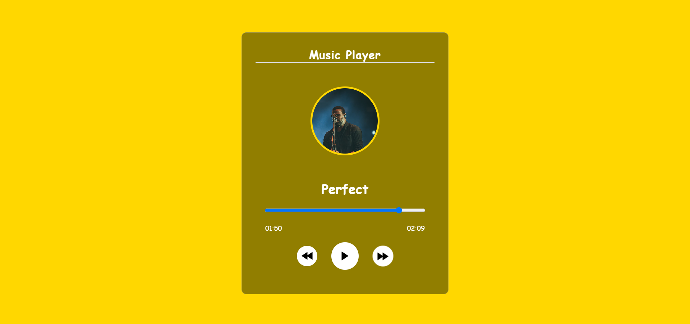

# Music Player Using HTML, CSS & JavaScript

This JavaScript code is part of a music player project implemented with HTML, CSS, and JavaScript. The player includes play/pause functionality, next and previous track navigation, a progress bar with a time display, and event listeners for user interactions.

## Screenshots

## How to Run?

1. Download the Project from the repo or just copy the content of all the file provided in the section.
2. Either open the index.html file  directly in the browser or just use live server in vs-code.